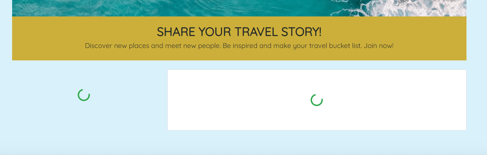
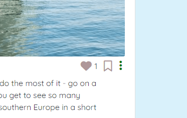

# **Travel Stories**

Travel Stories is a social networking platform targeted towards everyone that loves to travel, want to share their adventures with others and keep track of feature destinations to visit. 

Travel Stories offers a spaces for users to document and share their travel experiances as stories. All stories can be liked and commented on so that the user can engage with the community. A story can also be saved, which will then connect it to a user bucket list. In the bucket list all feature destinations that the user wants to visit can be listed along with notes of what activites the users wiches to do at that location. This enables the user to document and organise their travel plans and stay connected to their favorite content creators. 

You can find the live site [here](https://travel-stories2-eeac1d39adbb.herokuapp.com/).

This project was built in two parts. This app makes up the front-end, built with React. The back-end API is powered by Django REST Framework and can be found [here](https://travel-stories-api2-af9d4146e908.herokuapp.com/).


## **Project goals**
The main objective with the platform is to inspire to travel, by engage people to share their travel stories, meet new people, discover new places to visit and in the end - travel more!

### **User goals**
A user can have more than one goal when visiting the platform. And one user may have different goals compared to another. Some users may only want to look at stories and be inspired. Some users may want to be inspired but also inspire others by sharing their own tavel stories and use the platform to communicate with other travelers by commenting and liking their stories. Some users might want to document their insipriation by saving a story from another user, build a bucket list and use the saved story as a tag on a bucket list item.

### **Site owner goals**
The goal is to provide the users with a reliable platform and a good user experiance that doesn´t take a way any of the inspiration and joy provided by the travel stories. The site should encurage continued user interactions and be of high quality. To make this possible the site should be intuitive, accessible and well structured. 

## **UX**

### **User Stories**
The user of Travel Stories would be anyone that enjoys traveling and also likes to get inspiration and share travel experiances with others. 

#### **EPIC - Home page, Travel Stories**
Handles viewing, creation, editation, deletion, saving and liking of stories shared on the site. It handles viewing, creation, editation and deletion of comments for each story. It also handles displaying of the most likes stories in a list and on separate pages.
- As a user I can view all shared travel stories so that I can be inspired and get ideas about where I want to travel.
- As a user I can create a travel story so that I can share my adventures and experiances with others.
- As a user I can like a travel story so that I can show to the creater/owner of the post that it interests me.
- As a user I can unlike a travel story that I have previously liked so that I have the possiblity change my mind.
- As a user I can create a travel story comment so that I can be in contact with other users and give feedback on stories that interests me.
- As a user I can edit a travel story comment that I have created so that I can make changes after it was created and decide what I want to share with other users.
- As a user I can delete a comment so that I can control what content I share with other.
- As a user I can save a travel story so that I don´t forget my favorite stories and can return to them whenever I want to.
- As a user I can view all my saved stories so that I don´t forget of places I want to visit and return to my favorite stories whenever I want to.
- As a user I can unsave a travel story that I have previously saved so that I have the possiblity to change my mind.
- As a user I can view a travel story so that I can get all details about a story.
- As a user I can view the top 5 most liked stories so that I know which stories are the most popular.

#### **EPIC - Authentication**
Handles the creation of user registration and signin/signout functionality.
- As a user I can register an account so that I can add stories, comment, like, save and create a bucket list, i.e. access everything only a signed up user can access.
- As a user I can sign in to my account so that I can add stories, comment, like, save and create a bucket list.
- As a user I can maintain my logged in status so that I don´t have to log in all the time.

#### **EPIC - Navigation**
Handles creation of navigation bar and conditional rendering of navbar items depending on user status.
- As a user I can use a navbar from every page so that I can reach all pages of the site.
- As a user I can view different navbar items depending on my status so that I know when I´m logged in and logged out.

#### **EPIC - Profile Page**
Handles creation of user profile page where the users information and stories are shown. It also handles editing ot the profile information.
- As a user I can view my and other users profile and all my and their created stories so that I can keep track of my own profile content and discover all stories made by a user.
- As a user I can edit my profile so that I can decide what I want to share with other users.

#### **EPIC - Bucketlist**
Handles viewing, creation, editation and deletion of bucketlist items i.e. destinations.
- As a user I can create a travel story so that I can share my adventures and experiances with others.
- As a user I can edit a destionation that I have created so that I can make changes to my bucket list as I for example discover more activites to do.
- As a user I can delete a destination so that I can control what my bucket list contains.
- As a user I can view my bucket list items (destinations) so that I can see what trips I dream about taking and activites to do on the trips.

### **Design**
The design is focused on giving the story images as much focus as possible, as they are a big part of attracting the users eyes to a story. The chosen colors are therefore quite neutral to not take too much user focus away from the images. The colors were also chosen with contrast ratio in mind, to make the site as accessible as possible.

The main font used is Quicksand. It is imported with [Google Fonts](https://fonts.google.com/) and was chosen because it give the platform a simple, modern and lively apperance.

#### **Wireframes**
Wireframes has been used to create the design of the pages of this site.

<details>

<summary>Home page</summary>


</details>

<details>

<summary>Log in page</summary>


</details>

<details>

<summary>Sign up page</summary>


</details>

<details>

<summary>Create story page</summary>


</details>

<details>

<summary>Edit story page</summary>


</details>

<details>

<summary>Profile page</summary>


</details>

<details>

<summary>Edit profile page</summary>


</details>

<details>

<summary>Bucketlist page</summary>


</details>

<details>

<summary>Add destination page</summary>


</details>

<details>

<summary>Edit destination page</summary>


</details>

<details>

<summary>Saved stories page</summary>


</details>

## **Agile Development**
The app was built using an agile approach, with a GitHub project board, milestones, labels and issues. The GitHub project board can be found [here](https://github.com/users/sarasm93/projects/8/views/1). Everthing that needed to be done to develop this app was divided into epics, and each epic was divided into user stories with tasks. All epics and user stories mentioned above were created with GitHub issues. The agile development iterations were created with milestones, i.e. all issues were linked to a milstone. They were also linked to an epic using labels. Labels have also been used to priorities which issues are most important by create labels namned "must have", "should have", "could have" and "wont´t have". 

## **Data models and database**
The ERD diagram shown below was made with [Lucid Charts](https://www.lucidchart.com/pages/landing?utm_source=google&utm_medium=cpc&utm_campaign=_chart_en_tier2_mixed_search_brand_exact_&km_CPC_CampaignId=1520850463&km_CPC_AdGroupID=57697288545&km_CPC_Keyword=lucid%20charts&km_CPC_MatchType=e&km_CPC_ExtensionID=&km_CPC_Network=g&km_CPC_AdPosition=&km_CPC_Creative=442433237648&km_CPC_TargetID=kwd-64262996435&km_CPC_Country=9062397&km_CPC_Device=c&km_CPC_placement=&km_CPC_target=&gclid=CjwKCAjwwb6lBhBJEiwAbuVUSp5GJupY-n0T0KIxQyga5tojqyWYZIbI3dXIpvdCgxbxCcPYgxb-_RoCMJAQAvD_BwE) and shows the structure of the PostgreSQL database used in this project. It visualises the types of data models required and the relationships between them. 

Django AllAuth was used for the user model and user authentication system.

The profile model was created so the user can create and save stories and create bucket list destination items that can be edited and deleted. 

The destination model holds all information about at destination item that a user can add to it´s bucket list, such as creator of the item, destination, activities, story tags and priority. 

The travel story model holds all information about a story, such as creator, title, destination, content, image and creation date.  

The save model makes it possible for the user to connect a bucket list destination item to a travel story by saving the story. 

The like model holds all information about a like, i.e. which user has made it and on which story. 

The comment model holds all information about a comment - which user has made it and on which story, the content of the comment and the creation date. 


## **Features**

### **Existing features**

#### **Features relevant to all pages**

##### **Header**
- Contains the logo and navigation bar. 
- Is located at the top of every page, as the user would expect. 
- The header provides links to all pages of the site to easily navigate between them. The logo is linked to the home page, making it easy to navigate back to it at any time. The navbar links to the other pages on the site; Saved (stories), Bucket list, Login/Logout, Profile, Sign Up and Create Story.
- The links turn light blue when hovering over them, indicating to the user that the objects is clickable. The link to the navbar item which the user is currently on stays light blue to make it very clear for the user where it is located on the site. 
- The navbar items changes depending on if the user is logged in or not. When logged in, the user gets access to profile page, bucket list and add story page.
- The navbar collapses into a hamburger icon on tablet (medium) devices and when clicking on it a sidnavbar opens up.


##### **Footer**
- The footer is located at the bottom of every page. 
- It contains the site logo which is a link to the home page, so that the user can easily be taken back to the travel stories from any place at the platform.
- The link text turns light rey when hovering over it, indicating to the user that the object is clickable.


On all pages, everything that is clickable has a hover effect so that it´s clear to the user when something is clickable and not. 

##### **Spinner**
- A spinner is shown on all pages where data is fetched from the api and rendered, during the data is fetched.



#### **Home page**

##### **Intro section**
- aims to give the user a warm welcome and is useful to the users as it gives them a first glance of what Travel Stories offers. It aims to make them interested and to make them want to continue exploring the page.
- the intro is short so that the user can go to the main part of the home page as quickly as possible (the story section)


##### **Story section**
- provides the user with all the stories shared on the site. This is where the user gets all the inspiration by scrolling (infinately) through the stories.
- a story is shown on a card and consists of a heading with the story title and location that the story is about. The date for when the story was created is also provided.
- the story image is shown in the middle of the story card and below that the actuall story content is displayed, along with the story owner profile image and username.
- a user can like and save a story by clicking on the symbols below the story in the bottom right corner. It is also provided with the number of likes and comments made on a story. 
- if the user is the owner of the story, the like and save symbols are made grey and the user won´t be able to like or save. The user can instead see a three dots-symbol. It can click the three dots in the bottom right corner and be redirected to the edit story page or delete a story. 
- the user can click at the very bottom of the story card, where there is a comment-symbol, to toggle out/in the comment section for the story. Here the user can create a comment and view other peoples comments. The user can also edit or delete it´s own comments by clicking the three dots symbol by a comment. The symbol is only shown for comments that the current user has made. The toggle functionality is made with React Bootstrap accordion component. 





##### **Most liked stories section**
- to the left on the home page, the 5 (or 3, on mobile) most liked stories on the site are shown in a vertical list, so that the user can keep track of popular stories.
- each story is shown on a card with the story title and story location displayed on the card that has the story image as background. 
- each card is a link to a separate page for the story. On that separate page, all the features of a single story descriped above (se Story section heading) is displayed. 


#### **Saved page**
- shows all the stories (infinate scrolling) a registered user has saved (by clicking the save symbol for a story). Everything else on this pages is the same as the home page.


#### **User pages**
The sign up, log in and log out functionality was created with Django allauth.

##### **Sign up**
- useful to the user as it makes it possible to create and save stories, comment, like and add a destination to bucket list. Provides a form with a submit button in the end.


##### **Log in**
- When the user has logged in the Sign up item is replaced by the Profile item and the the Login navbar item changes to Logout. A Create Story item, Saved (stories) and Bucket list item is also added to the navbar. 


##### **Log out**
- When the user has logged in the Logout navbar item changes to Login and the Sign up item replaces the Profile item. The Create Story item, Saved (stories) and Bucket list item is removed.

#### **Create story**
- user is taken to this page when the Create Story button in the navbar has been clicked.
- show a form, where an image can be added along with story title, destination and the story content.
- if any field is not correctly filled in the user will be alerted with a message under the field.
- the user can choose to cancel the creation and go back to the previous page by clicking the cancel button.


#### **Edit story page**
- at this page the user can edit a story. It provides the user with a edit form to edit all fields in the form. To edit the user needs to add correct form input and click the "Update" button.
- the user can also choose to cancel the editing and go back to the previous page.
- the form is built up in the same way as in the add story page, so that the user recognise the format.
- when a story is updated the user is taken to the profile page where the created story is shown at the top of the page (ordering by story creation date). 
- if any field is not correctly filled in the user will be alerted with a message under the field.

 

#### **Profile page**
- is used by site visitors to learn everything about a user that has created an account (profile) on the site. 
- shows the profile owners profile image, biography, location and number of stories shared. It also shows the users shared stories in a list.
- the owner of the profile can click the pen symbol to edit the username, password or add and edit the profile biography and location. When clicking the user is taken to a new page with the respective edit form.
- if the user hasn´t created any stories yet a messages is shown to the visitor   


#### **Edit profile presentation page**
- the user can edit its profile presentation by clicking the pen on the profile page and choose Edit profile presentation.
- the form is very similar to most of the other forms at the page, so the user recognizes it.
- non of the fields are required as it should be optional how much info the user wants to share.


#### **Edit profile username page**
- the user can edit its username by clicking the pen symbol on the profile page and choose Edit username.
- the user is taken to a form to edit and then submit or cancel


#### **Edit profile password page**
- the user can edit its username by clicking the pen symbol on the profile pageand choose Change password.
- the user is taken to a form to edit and then submit or cancel


#### **Add destination page**
- provides the registered user with the opportunity to create a bucketlist item, i.e. destination, that is added to a bucketlist of destinations the user want´s to visit.
- shows a form where the user needs to add a destination, activites that the user wants to do at the destination, a priority (when in time) and a story tag. The story tag is a story that the user has gotten inspiration from and saved, and then used as a tag on destinations to remember where the inspiration for the bucketlist destination came from.
- the user can also choose to cancel the creation and go back to the previous page.


#### **Bucket list page**
- the page where the registered user can view all its created bucketlist destinations, in order based on which priority the user has given each destination (from Now at the top to Might happen at the bottom). 
- each destination has a Edit and a Delete button, so the user can manage the content of its bucketlist. 
- if the user hasn´t created any stories yet a messages is shown to the visitor 


#### **Edit destination page**
- the user is taken to this page after clicking the Edit button on the bucketlist page.
- at this page the user can edit a destination. It provides the user with a edit form to edit all fields in the form. To edit the user needs to add correct form input and click the "Update" button. 
- the user can also choose to cancel the editing and go back to the previous page.
- when a story is updated the user is taken to the bucket list page where the user can see that the destination has been added.
- if any field is not correctly filled in the user will be alerted with a message under the field.

 

#### **Not found page**
- handles when a user types a url that doesn´t exist on the site.
- shows a nice image and a message saying "Sorry, this page could not be found." to clearly show the user nothing could be found.

 

### **Future features**
- Users can filter the stories on the home page.

The above feature is listed in a GitHub Project used as backlog for the app. The backlog is found [here](https://github.com/sarasm93/travel-stories-api2/issues).

## **Components**

### **Navbar**
The navbar component is displayed on all pages, with conditional rendering of the navlinks depending on authentication of the user. 

### **Footer**
The footer is, just like the navbar component, imported to app.js and displayed on all pages of the site. It contains the site logo as a link to the homepage. 

### **Asset**
Renders different versions of it self depeding on which props is passed to it. It renders either a loading spinner, an image, and/or a message and is used on several pages of the site.

### **Avatar**
Displays the user profile image and is used everytime the user profile image is rendered, for example on each story card, beside each story comment and on the profile page. 

### **MoreDropDown**
Is used for all stories, comments and profiles and displays a dropdown menu with options edit or delete.

### **Story card**
Used to render a story everywhere a story is shown on the site, for example on the home page, when user views one of the most liked stories and on the profile page. 

### **useRedirect hook**
Used on several pages to redirect the user depending on the authorization status of the user.

## **Testing**
The site has been tested so that it works on different browsers. It has been tested on Google Chrome, Microsoft Edge and Firefox.

The site is responsive. The responsivness was tested with Google Chrome Dev Tools and [Am I responsive](https://ui.dev/amiresponsive). 

The accessibility of the site has been checked with Lighthouse in DevTools. The results for the final site is shown below. The performance score was affected a bit by image sizes. All images have been optimized with tinypng.com but in the feature a caching library could be used as well.


### **Manual testing**
Google Chrome Dev Tools was used to test the site through out the development.

#### **Spinner**
| Feature | Action | Expected outcome | Pass/Fail |
| --- | --- | --- | --- |
| spinner | when visiting a page where data must be fetched from api | spinner shows | pass |

#### **Header with navbar**
| Feature | Action | Expected outcome | Pass/Fail |
| --- | --- | --- | --- |
| logo planet | hover | change color to blue | pass |
| navbar items | hover | change background color to light blue and text to light grey | pass |
| navbar items symbols | hover | change color to light green | pass |
| logo | click | redirect to home | pass |
| navbar items | click | redirect to correct page | pass |

#### **Footer**
| Feature | Action | Expected outcome | Pass/Fail |
| --- | --- | --- | --- |
| logo planet | hover | dont change color | pass |
| logo | click | redirect to home | pass |

#### **Home page, Saved stories page, story section of profile page and separate most-liked-story-page**
| Feature | Action | Expected outcome | Pass/Fail |
| --- | --- | --- | --- |
| story like | click symbol | like can be made, like symbol turns green | pass |
| story save | click symbol | save can be made, save symbols turns green and count increase by 1 | pass |
| all symbols and profile username | hover | slight change in color | pass |
| story like | hover symbol | if user is owner of story, symbol i grey and a message is shown with info that it cannot be liked | pass |
| story save | hover symbol | if user is owner of story, symbol i grey and a message is shown with info that it cannot be saved | pass |
| profile avatar | click | redirect to profile page | pass |
| comment symbol | click | toggle out or toggle in comment form and comments under story card | pass |
| comment form | write and click post symbol | submit comment, comment is shown below form, comments count increase by 1 | pass |
| comment | see three dots-symbol | when owner of comment views its comment | pass |
| comment | click on three dots-symbol | show dropdown meny with edit and delete options that will delete comment or make the comment into edit form | pass |
| most liked story card | hover | shadow on card | pass |
| most liked story card | click | go to story page for the story clicked | pass |
| stories on home page, saved page and profile page | scroll | infinate scroll | pass |
| story | see three dots-symbol | when owner of story views its story | pass |
| story | click on three dots-symbol | show dropdown meny with edit and delete options that will delete story or get redirected to edit from | pass |

#### **Create story page**
| Feature | Action | Expected outcome | Pass/Fail |
| --- | --- | --- | --- |
| default camera image | click | add image | pass |
| all buttons | hover | color effect | pass |
| Create button | click | submit form, create story and get redirected to profile page | pass |
| cancel button | click | go back to previous page | pass |
| change button | click | change image | pass |
| create button | click | if user form input is invalid by entering invalid input, error message is shown | pass |

#### **Profile page presentation section on top**
| Feature | Action | Expected outcome | Pass/Fail |
| --- | --- | --- | --- |
| story count| view | correct number | pass |
| pen symbol | view | if user is owner of profile | pass |
| pen symbol | click | show dropdown with options edit username, change password and edit presentation and get redirected to these pages | pass |
| pen symbol | view | if user is owner of profile | pass |

#### **Profile page edit forms**
| Feature | Action | Expected outcome | Pass/Fail |
| --- | --- | --- | --- |
| all buttons | hover | color effect | pass |
| Create button | click | submit form, change username/password/presentation and get redirected to profile page with updated data | pass |
| cancel button | click | go back to previous page | pass |
| create button | click | if user form input is invalid by entering invalid input to form fields, error messages are shown | pass |
| change button | click | change image | pass |

#### **Bucketlist page**
| Feature | Action | Expected outcome | Pass/Fail |
| --- | --- | --- | --- |
| all buttons | hover | color effect | pass |
| destinations (bucketlist items) | scroll | infinate scroll | pass |
| story tag link | click | send user to the separate page for the story that was tagged | pass |
| Add destination button | click | get redirected to create destination form | pass |
| delete button | click | delete the destination | pass |
| edit button | click | get redirected to edit page for destination | pass |

#### **Add destination page**
| Feature | Action | Expected outcome | Pass/Fail |
| --- | --- | --- | --- |
| all buttons | hover | color effect | pass |
| add button | click | submit form, create destination and get redirected to bucketlist page | pass |
| cancel button | click | go back to previous page | pass |
| add button | click | if user form input is invalid by entering invalid or have not entered input to all field except story tag, error messages are shown | pass |
| story tag dropdown | click | show all stories that the current user has saved | pass |

#### **Edit destination page**
| Feature | Action | Expected outcome | Pass/Fail |
| --- | --- | --- | --- |
| all buttons | hover | color effect | pass |
| all form fields | page loaded | prefilled with destinatons data for the destination that is being edited | pass |
| update button | click | submit form, update destination and get redirected to bucketlist page | pass |
| cancel button | click | go back to previous page | pass |
| update button | click | if user form input is invalid by entering invalid or have not entered input to all field except story tag, error messages are shown | pass |
| story tag dropdown | click | show all stories that the current user has saved | pass |

#### **Sign Up page**
| Feature | Action | Expected outcome | Pass/Fail |
| --- | --- | --- | --- |
| "log in" link | click | open Log In page | pass |
| "Register" button | hover | color effect | pass |
| "Register" button | click | if user form input is valid by entering correct input to all fields, go to log in page | pass |
| "Register" button | click | if user form input is invalid by not entering correct input to all fields, show error messages on form until all fields have correct input | pass |

#### **Log In page**
| Feature | Action | Expected outcome | Pass/Fail |
| --- | --- | --- | --- |
| "here" link | click | open Sign Up page | pass |
| "Log In" button | hover | color effect | pass |
| "Log In" button | click | if user form input is valid by entering a registered username and password, open home page with new navbar items | pass |
| "Log In" button | click | if user form input is invalid by entering invalid username and/or password, error message is shown | pass |

### **Validator testing**
Throughout the development, the JSX and React Bootstrap code had been validated via feedback from npm in the terminal. The CSS code has also been put through the [W3C CSS Validation Service](https://jigsaw.w3.org/css-validator/#validate_by_input). The code has been adjusted according to the feedback.

### **Resolved problems and bugs**
The stories saved by a user wasn´t showing on the saved stories page under the Saved tab in the navbar. A 500 error was thrown. This was solved by putting debug=True in the back end so a all errors could be shown in the front end app that was related to the back end. Then it was obvious that there was a typo in the filter on the front end to filter out the saved stories. 

On the create destination page, there was a problem with rendering the name of the priority options (e.g. "Now" for option with value 1, "Soon" for value 2 aso.). This was solved by adding a ternary that renders the names depending on which value is fetched from the api. There was also a problem with making the priority field required and show an alert message if no option is selected. This was solved by adding if statements to the handleSubmit function in the DestinationCreateForm.js - if `priority == ""` show an alert message; if `priority !== ""` submit the form. 

When creating a destination (bucketlist item) this statement was added to the handleSubmit function to make it possible to submit the create form without selecting a story tag:
```
if (story_tag !== "") 
    formData.append("story_tag", story_tag);
```
When editing the destination there were problems with submitting the form without a story tag due to the value of story tag being undefined when submitting. The solution to this was adding a slightly different statement saying if story tag is not 0, and edits were made, append story tag to formData:
```
if (story_tag.length !== 0) {
    formData.append("story_tag", story_tag);
}
``` 
When submitting a comment, instead of showing the placeholder text "Comment here" in the form, the comment text that was just submitted was still displayed. This was caused by a missplacement of the call to the setContent()-function in CommentCreateForm.js, which was placed after the setStory(). To solve this the setContent(""); was simply moved ahead of setStory(), see image below.


On medium screen sizes, the nav item text was too big and made the items render outside of the navbar due to the text jumping down to the next row. To solve this, some padding was removed and the font-size was decreased. 

The comments count on storypage.js wasn´t updating when the user has made a comment unless the page was refreshed. This was solved by adding a ternary to check if comments has length and if so show that number, otherwise show the previous number of comments.

The footer was hiding content on the page (see image). This was solved giving the main app container a bottom margin of 70px.


After deleting a destination at the bucketlist page, the user is kept on the bucketlist page by the handleDelete function, i.e. the page where the deletion is made from. This meant that the deleted post was still shown in the browser window after deletion. The bucketlist needed to be refreshed in order to show the updated list of destinations. I used [this page](https://timmousk.com/blog/react-reload-page/) to figure out how to do that, namely by adding `window.location.reload();` in the handleDeletefunction. 

When using the finished app in Google Chrome with the Google Chrome Dev Tools open, the console sometimes show a warning saying "Can't perform a React state update on an unmounted component", see image below. At first the warning seemed to show up at random but after some testing it seems to only show up when refreshing the page with the browser refresh button and at the same time holding down the Ctrl-button. I tried to find any relevant information on the Code Institute Slack chanels and by google searching but I think most information/solutions I found didn´t quite fit in to the description of my problem. A Code Institute tutor was also consulted with this issue but the tutor couldn´t see the warning, not even when refreshing the page like described above. As testing hasn´t found that the warning affects any functionality on the page, the warning has been left without any action. 


## **Deployment**
The site was deployed to Heroku from GitHub with the following steps:

1. In the package.json file add this code `"heroku-prebuild": "npm install -g serve",` in the scripts section. Then create a Procfile in the root directory and add `web: serve -s build` in it.

1. Create a Heroku app by logging in to your Heroku account. Click the "New" button in the top right corner and then "Create new app". Give it a name, choose a region and then click the "Create app" button. 

2. In Gitpod, save all files, add, commit and push your code to GitHub. Then go to Heroku. Scroll to the top menu and click the "Deploy"-tab. Scroll to the "Deployment method"-sction and select GitHub. In the "Connect to Github"-section that shows up, click on "Connect to GitHub". When the connecting is done you will see a search bar where you can search for the repository name. Click on the "Connect"-button that shows up when Heroku has found your repository. Scroll further down and choose either to deploy automatically by clicking the "Enable Automatic Deploys" or deploy manually by clicking the "Deploy Branch"-button. When the deployment is finished you can go to the "Settings"-tab again and scroll down to the "Domains"-section where you can find the link to your deployed app.

## **Technologies, Languages, Frameworks, Libraries, software and Sites used**

### **Languages**
- JSX (Javascript, HTML, CSS)

### **Libraries**
- [React](https://legacy.reactjs.org/) - main Javascript library for creating the user interface
- [react-Bootstrap](https://react-bootstrap-v4.netlify.app/) - to make the site responsive and to style user interface, for example navbar, footer, signup form, destination form with select dropdown field, story cards, saved stories on badges, toggle comments with accordion aso. 
- [axios](https://axios-http.com/docs/intro) - HTTP library used to make requests
- [react-router-dom](https://reactrouter.com/en/main) - routing based on URL
- [jwt-decode](https://www.npmjs.com/package/jwt-decode) - decoding of JWTs token 
- [react-dom](https://www.npmjs.com/package/react-dom) - the entry point to the DOM and server renderers for React
- [react-infinite-scroll-component](https://www.npmjs.com/package/react-infinite-scroll-component) - component to implement infinite scrolling
- [react-scripts](https://www.npmjs.com/package/react-scripts) - scripts and configuration used by Create React App

### **Extensions**
- [JSONView](https://chrome.google.com/webstore/detail/jsonvue/chklaanhfefbnpoihckbnefhakgolnmc) - to view correctly formatted JSON in the browser
- [ES7 React/Redux/GraphQl/React-Native](https://marketplace.visualstudio.com/items?itemName=dsznajder.es7-react-js-snippets) - snippets that allow fast typing of code with shortcuts
- [Prettier](https://marketplace.visualstudio.com/items?itemName=esbenp.prettier-vscode) - code formatter to prettify code rendered in browser

### **Software and sites**
- [ElephantSQL](https://www.elephantsql.com/) - PostgreSQL database system (cloud based) used for the database for this app
- [Git and GitHub](https://github.com/) - version control and as agile tool
- [Lucidchart](https://www.lucidchart.com/pages/landing?utm_source=google&utm_medium=cpc&utm_campaign=_chart_en_tier2_mixed_search_brand_exact_&km_CPC_CampaignId=1520850463&km_CPC_AdGroupID=57697288545&km_CPC_Keyword=lucidchart&km_CPC_MatchType=e&km_CPC_ExtensionID=&km_CPC_Network=g&km_CPC_AdPosition=&km_CPC_Creative=442433237648&km_CPC_TargetID=kwd-33511936169&km_CPC_Country=9062397&km_CPC_Device=c&km_CPC_placement=&km_CPC_target=&gclid=Cj0KCQjwnMWkBhDLARIsAHBOftrLqk9mpk7BpbSpfCB82TCw4CoQ4k4-1IqLKE5G5i3Cs5Q-3_ysvx4aAtpTEALw_wcB) - create database model schema
- [Cloudinary](https://cloudinary.com/) - image hosting and management 
- [Lucidspark](https://lucidspark.com/landing?utm_source=google&utm_medium=cpc&utm_campaign=_spark_en_tier2_mixed_search_brand_exact_&km_CPC_CampaignId=11277231989&km_CPC_AdGroupID=111001815336&km_CPC_Keyword=lucidspark&km_CPC_MatchType=e&km_CPC_ExtensionID=&km_CPC_Network=g&km_CPC_AdPosition=&km_CPC_Creative=470704657836&km_CPC_TargetID=kwd-949956719693&km_CPC_Country=9062397&km_CPC_Device=c&km_CPC_placement=&km_CPC_target=&cq_cmp=11277231989&gclid=CjwKCAjwxaanBhBQEiwA84TVXKQNvVHxVJakGCqhU5psJMpyaLND2-0NbzWie1Sf7iLZyeyqbCW13RoCv3AQAvD_BwE) - create wireframes
- [TinyPng.com](https://tinypng.com/) - to compress/optimize images

## **Credits**
This project was developed as a portfolio submission project as part of [Code Institute's](https://codeinstitute.net/se/) Diploma in Full Stack Software Development and Code Institute's walkthrough project [Moments](https://github.com/Code-Institute-Solutions/moments) has been used as a tempalate for this project. I have then made customizations and expanded it by adding new features and functionality. 

I used the readme.md file for my [Cinerama Cinema project](https://github.com/sarasm93/cinerama-cinema) as base for the readme.md file for this project and used some text from it as well. Inspiration for the readme was also gotten from the [Garden Diaries project](https://github.com/EmelieMarkkanen/p5-garden-diary/tree/main#features) and the [Gear Addict project](https://github.com/Matthew-Hurrell/gear-addict#components).

[Lonely planet](https://www.lonelyplanet.com/) has partly been used to get ideas about what to include in this project.

[Favicon converter](https://favicon.io/favicon-converter/) was used to create a favicon of [this image](https://pixabay.com/sv/vectors/klot-jorden-kontinenter-planet-296471/) from Pixabay.com, which is also used as logo.

[The garden diaries project](https://github.com/EmelieMarkkanen/p5-garden-diary/tree/main) was used to understand how the React Bootstrap Image component could be used together with the roundedCircle prop to get a nice round logo in the navbar.

Used [this stack overflow page](https://www.pluralsight.com/guides/how-to-get-selected-value-from-a-mapped-select-input-in-react) to understand how to map through story tag select options in DestinationCreateForm.js

CSS code was taken from [this site](https://www.upbeatcode.com/react/how-to-write-text-on-image-in-react-js/) for the popular stories cards on the home page, to place the text in the center of the card on top of the image.

CSS code for box-shadow on most-liked-stories-cards was taken from [this Codepen.io page](https://codepen.io/ovdojoey/pen/BomKyZ). 

[This stack overflow page](https://stackoverflow.com/questions/65546190/alert-not-working-with-react-hooks-bootstrap) was used to figure out how to display a custom alert message for the priority field in the DestinationCreateForm.js form. 

Images:
- Pixabay.com
	- [default upload image](https://pixabay.com/sv/vectors/kamera-ikon-symbol-foto-svart-2008479/)
	- [page not found](https://pixabay.com/sv/illustrations/webb-karta-platt-design-stift-3120321/)
	- [hero image on home page](https://pixabay.com/sv/photos/bl%C3%A5-strand-surfa-resa-surfare-4145659/)
	- [hero image on bucketlist page](https://pixabay.com/sv/photos/death-valley-v%C3%A4g-%C3%B6ken-landskap-4250244/)
	- default profile image is taken from the [Code Institute Moments project](https://github.com/Code-Institute-Solutions/moments)
	- [whale](https://pixabay.com/sv/photos/val-hav-vatten-4424846/)
	- [Margret](https://pixabay.com/sv/photos/kvinna-strand-hoppa-glad-kvinna-332278/)
	- [new york](https://pixabay.com/sv/photos/gl%C3%A4dje-v%C3%A4lkommen-vi-ses-kram-tur-370387/)
	- [Trinity College Library](https://pixabay.com/sv/photos/dublin-bibliotek-trinity-college-2450620/)
	- [daniel](https://pixabay.com/sv/photos/lycklig-man-vuxen-stad-ansikte-1836445/)
	- [mary](https://pixabay.com/sv/photos/lycklig-par-k%C3%A4rlek-m%C3%A4nniskor-lycka-4191133/)
	- [layla](https://pixabay.com/sv/photos/par-turister-b%C3%A5t-leende-selfie-5941079/)
	- [jim](https://pixabay.com/sv/photos/par-turister-b%C3%A5t-leende-selfie-5941079/)
	- [Hoi an](https://pixabay.com/sv/photos/m%C3%A4nniskor-gata-hoi-en-trottoar-5528959/)
	- [sailing](https://pixabay.com/sv/photos/fartyg-b%C3%A5t-sj%C3%B6-segelb%C3%A5t-italien-952292/)
	- [rome](https://pixabay.com/sv/photos/colosseum-rom-italien-romare-1014310/)
	- [iceland](https://pixabay.com/sv/photos/island-vattenfall-flod-vatten-5217702/)
	- [tokyo](https://pixabay.com/sv/photos/japan-asien-neon-streetm-city-resa-4141581/)
	- [Alpine hike](https://pixabay.com/sv/photos/%C3%A4ventyr-h%C3%B6jd-%C3%B6ver-havet-ryggs%C3%A4ck-1850912/)
	- [zanzibar](https://pixabay.com/sv/photos/strand-h%C3%A4ngmatta-bl%C3%A5-himmel-moln-1868047/)
	- [Grand Canyon](https://pixabay.com/sv/photos/grand-canyon-amerikas-f%C3%B6renta-stater-2411051/)

Information for story destinations:
- [Whale safari](https://www.newzealand.com/int/plan/business/auckland-whale-and-dolphin-safari/)
- [Laugavegur trek](https://adventures.com/blog/best-hikes-iceland/)
- [The Alpine Pass Route](https://www.utracks.com/Switzerland/Self-Guided-Walking/The-Alpine-Pass-Route)
- [The Grand Canyon](https://www.getyourguide.com/arizona-l488/grand-canyon-south-rim-self-guided-tour-t401021/)

## **Acknowledgements**
I want to thank all the Code institute tutors that has help me and my mentor Antonio Rodriguez for all the valuable support and help during the development of this project. 
